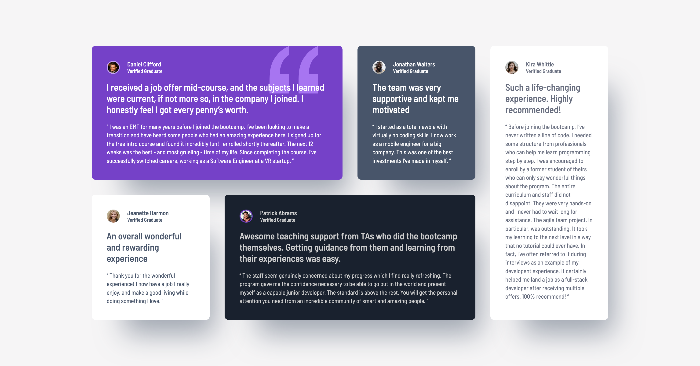

# Frontend Mentor - Testimonials grid section solution

This is a solution to the [Testimonials grid section challenge on Frontend Mentor](https://www.frontendmentor.io/challenges/testimonials-grid-section-Nnw6J7Un7). Frontend Mentor challenges help you improve your coding skills by building realistic projects. 

## Table of contents

- [Overview](#overview)
  - [The challenge](#the-challenge)
  - [Screenshot](#screenshot)
  - [Links](#links)
- [My process](#my-process)
  - [Built with](#built-with)
  - [What I learned](#what-i-learned)
  - [Continued development](#continued-development)
- [Author](#author)

## Overview

### The challenge

Users should be able to:

- View the optimal layout for the site depending on their device's screen size

### Screenshot

### Links

- Solution URL: [Add solution URL here](https://your-solution-url.com)
- Live Site URL: [Ahttps://rainbowsurfer137.github.io/testimonials-grid-section/](https://rainbowsurfer137.github.io/testimonials-grid-section/)

## My process

### Built with

- Semantic HTML5 markup
- CSS custom properties
- CSS Grid
- Mobile-first workflows

### What I learned

This project helped me better understand CSS Grid, particularly how to use grid-template-areas for flexible layouts. I also refined my background-image positioning skills, making sure elements aligned correctly within their containers.

### Continued development

I want to deepen my understanding of CSS Grid and Flexbox to create even more dynamic and adaptable layouts. Additionally, I plan to work more on accessibility, ensuring semantic HTML and ARIA roles improve usability for all users.

I’ll also explore CSS clamp() and min(), max() functions to make designs even more flexible.

## Author

- Frontend Mentor - [@rainbowsurfer](https://www.frontendmentor.io/profile/rainbowsurfer137)

